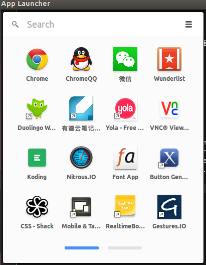
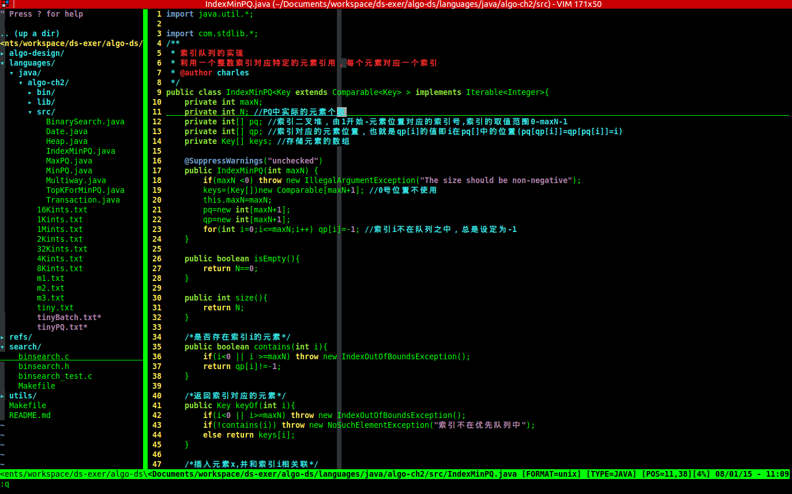

# 安装Ubuntu 14.10后要做的几件事

---

## 基础配置
**1. 更新软件源**

装好ubuntu的第一件事就是添加更快速的源，因为官方提供的源服务器在国外,访问和下载速度要比国内源慢些，可以采用一些国内公司和大学提供的更新源.

方法一：  在`System Settings -> Software & Updates`,在`Download from`中在中国区选择速度最快的服务器源。这种方法比使用命令行快很多。

方法二：命令行设置：
- 备份原有源,恢复时有用 `sudo cp /etc/apt/sources.list /etc/apt/sources.list.backup`
- 修改更新源，添加相应的镜像源(个人常用163源、yun-idc源) ` sudo gedit /etc/apt/sources.list`
- 更新源`sudo apt-get update` 然后再升级系统`sudo apt-get upgrade`


- - - 

**2. linux打开txt文件乱码**

缺省配置下，用Ubuntu的文本编辑器（gedit）打开GB18030（繁体中文用户可将GB18030替换成BIG5或BIG5-HKSCS）类型的中文编码文本文件时会发生乱码。这是因为gedit使用一个编码匹配列表，只有在这个列表中的编码才会进行匹配，不在这个列表中的编码将显示为乱码。您要做的就是将 GB18030 加入这个匹配列表。

- Gedit 2.x版本设置（适用于Ubuntu 11.04及以前）

安装gconf-editor： `sudo apt-get install gconf-editor`

手动方式：
在弹出的配置中选择：“apps”—“gedit2”—“preferences”—“encodings”。双击右边名称“auto-    detected”，在弹出的编辑键菜单中，添加编码GB18030，GBK，GB2312，移到最上面即可                         

命令行方式： 
```
gconftool-2 --set --type=list --list-type=string /apps/gedit-2/preferences/encodings/auto_detected
"[UTF-8,CURRENT,GB18030,ISO-8859-15,UTF-16]"
```

- Gedit 3.x版本设置（适用于Ubuntu 11.10及以后）

安装dconf-editor: `sudo apt-get install dconf-tools`

手动方式：
步骤类似，在org/gnome/gedit/preferences/encodings下添加中文编码方式

命令行方式:
```
gsettings set org.gnome.gedit.preferences.encodings auto-detected "['GB18030', 'UTF-8', 'CURRENT', 'ISO-8859-15', 'UTF-16']"
```


- - -

**3. 开机自动加载Windows分区**

a. 在root权限下查看分区： `fdisk -l`

b. 统计windows分区，执行如下命令
   `sudo mkdir -p /media/charles/{windows分区名字}`

c. 编辑描述各种文件系统信息的文件/etc/fstab,添加对应Windows分区信息： `sudo gedit /etc/fstab`

```
# <file system> <mount point> <type> <options> <dump> <pass>
# / was on /dev/sda6 during installation
UUID=df8a06fe-6507-4242-80bc-85db21b15c9b / ext4 errors=remount-ro 0 1
# swap was on /dev/sda5 during installation
UUID=911758dc-eba4-4624-abad-c9b4a2b1b3cf none swap sw 0 0

# reserved partition
/dev/sda1 /media/charles/reserc ntfs none 0 0

# windows partition
/dev/sda2 /media/charles/winc ntfs none 0 0

# work partition
/dev/sda3 /media/charles/work ntfs none 0 0
```

---

**4. 安装搜狗输入法**

a. 安装fcitx版本： `sudo apt-get install fcitx`

b. 下载32位或64位的Ubuntu deb版[搜狗输入法](http://pinyin.sogou.com/linux/?r=pinyin)

---

**5. 远程管理主机**

**A ssh命令行登陆**

a. ubuntu下开启ssh服务

安装ssh服务器： `sudo apt-get install openssh-server`
查看ssh服务是否在后台开启，出现了sshd字样表示ssh后台服务默认已开启
```
charles@charles-t400s:~$ ps -e | grep ssh
10588 ?        00:00:00 sshd
```

你的服务器也可以是Mac或者Windows，只需要安装ssh服务器，并开启ssh后台服务即可

b. Windows下安装ssh客户端 

- [secure shell client](http://www.wm.edu/offices/it/services/software/licensedsoftware/webeditingsftp/sshsecureshell/index.php)：免费开源，但中文显示乱码，无法传输中文乱码名的文件，不能记住密码

- [putty](http://www.putty.org/) : 占用内存最小，每次登陆时需要重新连接，可通过设置编码为UTF-8不会显示中文乱码

- **[Xshell和Xftp](http://www.netsarang.com/download/free_license.html)**: 商用软件，但有免费版，可以保存设置的登陆会话，能记住密码，传输文件和显示中文时都可以通过设置编码为UFT-8而不会产生乱码，效果最佳。
 
推荐使用XShell+Xftp软件，创建新会话，填写完ip地址、用户名和密码就可登陆你的Ubuntu服务器

**B 远程界面登陆服务器**

a. 安装x11vnc： `sudo apt-get install x11vnc`

b. 设置vnc连接密码，根据提示输入密码并保存：
```
charles@charles-t400s:~$ x11vnc -storepasswd
Enter VNC password: 
Verify password:    
Write password to /home/charles/.vnc/passwd?  [y]/n y
Password written to: /home/charles/.vnc/passwd
```
c. 启动vncserver:

- 后台自动启动
   1. `sudo cp ~/.vnc/passwd /etc/x11vnc.pass`
   2. 创建/etc/init/x11vnc.conf文件，内容如下：
```
start on login-session-start
script
       x11vnc -display :0 -auth /var/run/lightdm/root/:0 -forever -bg -o /var/log/x11vnc.log -rfbauth /etc/x11vnc.pass -rfbport 5900  
end script
```

- 单次手动启动: `x11vnc -forever -shared -rfbauth ~/.vnc/passwd`

d. 重启ubuntu系统，再在Windows上用vnc viewer登陆

输入VNC Server名字-IP地址：端口号，后再输入设置vnc的连接密码

e. x11vnc常用命令(待补充)

x11vnc -kill :1 杀掉1号端口的vnc server进程

---

**6. 基础软件**

由于平时开发主要在Ubuntu平台上，所以一般首先考虑软件的跨平台性，下面是个人经常使用的软件：

- 办公软件： [WPS for Linux](http://community.wps.cn/download/) + Ocular阅读器
- 影音播放： Audacious + VLC + [SMPlayer](http://smplayer.sourceforge.net/en/downloads)结合使用
- 你懂的: [GAE](https://github.com/goagent/goagent) 
> 下载并遵循说明：https://github.com/goagent/goagent/blob/wiki/InstallGuide.md 
>
> 1. 让linux上先连上一小时VPN,保证连接gmail邮箱时能访问 
> 修改local下面的proxy.ini，添加appid-charlesxiong1314 
> 2. 运行server下面的文件：python uploader.py 
> 输入appid，邮箱和密码  
> 3. linux下在local中运行sudo python proxy.py(保证根管理员权限，添加证书) 
> 然后在Chrome中导入证书：Settings->HTTPS/SSL->Authorities->Import,导入local下CA.crt,全部勾选,否则会出现Privacy error:Your connection is not private 
> 4. 给Chrome安装SwitchySharp扩展 
> 从local中导入备份文件SwitchyOption.bak,更新自动切换规则(先运行goagent再更新规则)，出现error downloading list一般是上一步证书没导入进去
> 5. 开机自动启动
> 先安装gtk托盘和python-vte
> ```
> sudo apt-get install python python-dev python-gevent
> sudo apt-get install python-appindicator python-vte
> ```
> 再在local文件夹下运行python addto-startup.py即可加入开机启动。

- 浏览器：[Google Chrome](http://www.google.cn/intl/zh-CN/chrome/browser/desktop/index.html) + 扩展插件(Proxy SwitchSharp、Vimium、Adblock)+App(安装QQ、微信，特别建议在Windows的Chrome浏览器安装vnc viewer,如下图所示)



- 截图工具：shutter(`sudo apt-get install shutter`)
- 跨平台思维导图： [XMind](http://www.xmind.net/download/linux/)
- Markdown编辑器： [haroopad](http://pad.haroopress.com/user.html)

---

# 开发环境
## **1 完善GCC/Python环境**

- 安装g++编译器
命令： `sudo apt-get install build-essential`
build-essential是一套完整的软件包，它提供了编译程序必需的软件包列表信息，包括gcc,libc

- 安装词法和语法分析器

命令：
```
sudo apt-get install flex
sudo apt-get install bison
```

---

## **2 配置Vim**

参考ma6174的[超强vim配置文件](https://github.com/ma6174/vim)，一键安装非常快速，省去了不少配置时间，参考运行截图：



```
wget -qO- https://raw.github.com/ma6174/vim/master/setup.sh | sh
```

主要是掌握它的快捷键命令：
- 多窗口操作
  - :sp + 文件名水平分割窗口
  - :vs + 文件名垂直分割窗口
  - Ctrl+w快速切换窗口
  
- Taglist和NerdTree
  - F3：快速打开或关闭树形目录
  - F9：查看当前代码结构及自动补全

- 其他
  - F5：一键运行程序
  - F6：代码格式化
  - F8：调试C和C++
  - F2：去除代码中的空行(个人觉得不实用)


---

## **3 安装Sublime text3**

a. 添加Sublime Text3的安装源，执行更新、安装

```
sudo add-apt-repository ppa:webupd8team/sublime-text-3
sudo apt-get update
sudo apt-get install sublime-text
```

b. 解决sublime text3无法输入中文的问题

- 安装C/C++的编译环境和gtk、libgtk2.0-dev

```
sudo apt-get install build-essential
sudo apt-get install libgtk2.0-dev
```

- 保存以下代码到文件sublime_imfix.c

```C++
#include <gtk/gtkimcontext.h>
void gtk_im_context_set_client_window (GtkIMContext *context,
          GdkWindow    *window)
{
  GtkIMContextClass *klass;
  g_return_if_fail (GTK_IS_IM_CONTEXT (context));
  klass = GTK_IM_CONTEXT_GET_CLASS (context);
  if (klass->set_client_window)
    klass->set_client_window (context, window);
  g_object_set_data(G_OBJECT(context),"window",window);
 
  if(!GDK_IS_WINDOW (window))
    return;
  int width = gdk_window_get_width(window);
  int height = gdk_window_get_height(window);
  if(width != 0 && height !=0)
    gtk_im_context_focus_in(context);
}
```

- 编译成共享库

```
gcc -shared -o libsublime-imfix.so sublime_imfix.c  `pkg-config --libs --cflags gtk+-2.0` -fPIC
```

- 拷贝到/opt/sublime_text目录下
注意：/opt/sublime_text/不同版本可能有所不同，请调整为自己安装版本的路径

```
sudo cp libsublime-imfix.so /opt/sublime_text/libsublime-imfix.so
```

- 修改/usr/bin/subl文件，在第一行加入：

```
export LD_PRELOAD=/opt/sublime_text/libsublime-imfix.so
```

- 修改sublime-text.desktop

`sudo vim /usr/share/applications/sublime_text.desktop`

```
[Desktop Entry]
Version=1.0
Type=Application
Name=Sublime Text
GenericName=Text Editor
Comment=Sophisticated text editor for code, markup and prose
Exec=/usr/bin/subl %F        #这里修改执行路径为/usr/bin/subl,subl文件刚才已经修改过，大家应该记得
Terminal=false
MimeType=text/plain;        
Icon=sublime-text
Categories=TextEditor;Development;
StartupNotify=true
Actions=Window;Document;
 
[Desktop Action Window]
Name=New Window
Exec=/usr/bin/subl -n       #这里修改执行路径为/usr/bin/subl,subl文件刚才已经修改过，大家应该记得
OnlyShowIn=Unity;
 
[Desktop Action Document]
Name=New File
Exec=/usr/bin/subl new_file    #这里修改执行路径为/usr/bin/subl,subl文件刚才已经修改过，大家应该记得
OnlyShowIn=Unity;
```

修改以上三处代码，保存。Sublime Text 3即可完全正常使用搜狗输入法输入中文

c. 安装Package Control和一些常用的插件

- 安装Package Control
使用Ctrl+~快捷键，输入下面一段代码：

```
import urllib.request,os; pf = 'Package Control.sublime-package'; ipp = 
sublime.installed_packages_path(); urllib.request.install_opener( 
urllib.request.build_opener( urllib.request.ProxyHandler()) ); 
open(os.path.join(ipp, pf), 'wb').write(urllib.request.urlopen( 
'http://sublime.wbond.net/' + pf.replace(' ','%20')).read())
```

- 使用Ctrl+Shift+P输入Install Package,安装以下插件
   - 解决中文乱码：GBK Encoding Support(如果文件的编码方式不被sublime text支持，需要再安装Codecs33 package,一般问题就解决了)，ConvertToUTF8(在创建html文件时有干扰)
   - 阅读源代码: ctags(需要先安装ctags)
   - 快速开发Web前端代码：Emmet
   - 侧栏右键功能增强：SideBar + Side Bar Git
   - 代码对齐和自动补齐：Alignment + CodeIntel
   - 其他：查找代码中的错误linter
   
---


## **4 安装Eclipse**

**A 安装JRE(注：使用对应的JDK也可以)**

a. 下载对应的[JRE版本](http://java.com/en/download/manual.jsp)，假定是jre1.7

b. 将JRE的解压子目录安装在/opt/java目录下，执行如下命令
```
sudo mkdir /opt/java
cd java
sudo tar -zxvf~/Downloads/jre-7u51-linux-i586.tar.gz /opt/java/
```

c. 将JRE1.7.0作为Java默认的运行时环境

这过程即是告诉系统我这里有一个可用的Java二进制包并且使用此包执行java命令
```
sudo update-alternatives  --install  "/usr/bin/java"  "java"  "/opt/java/jre1.7.0_51/bin/java"  1 
sudo update-alternatives  --set  java   /opt/java/jre1.7.0_51/bin/java
```

最后命令行输出如下信息表示设置成功：
```
update-alternatives : using /opt/java/jre1.7.0_51/bin/java to provide /usr/bin/java (java)in manual mode
```

d. 检测是否安装成功，执行`java-version`,安装成功输出如下信息

```
java version "1.7.0_51"
Java(TM) SE RuntimeEnvironment (build 1.7.0_51-b13)
Java HotSpot(TM) ServerVM (build 24.51-b03, mixed mode)
```

e. **如果想在Linux命令行下运行Java程序，同样也需要配置环境变量**

方法一: 修改/etc/profile文件，修改系统级的环境变量，对所有用户的shell都适用

```
export JAVA_HOME=/opt/java/jdk1.7.0_51 
export PATH=$JAVA_HOME/bin:$PATH
export CLASSPATH=.:$JAVA_HOME/lib/dt.jar:$JAVA_HOME/lib/tools.jar
```

注：

1. 选择安装的jdk目录，JAVA_HOME目录后面不要多添加/，在Linux下用冒号来分割路径，赋值时变量值前加$符号
2. CLASSPATH中当前目录. 不能丢，利用export将这三个变量导出为全局变量
3. 使用source /etc/profile使其生效或注销重新登陆
4. 查看当前的系统变量使用如下命令：
`echo $PATH | tr ':' '\n'`


方法二： 修改.bash_profile文件，把这些环境变量的权限控制到用户级别，只允许某个用户使用这些环境变量，同样也是在.bash_profile文件末尾添加这三行代码,再重新登陆

最后一种办法： 在当前shell中临时设置变量，退出当前shell后就失效了

f. 补充Windows下配置Java环境

```
JAVA_HOME=C:\Program Files\Java\jdk\
PATH=%PATH%;%JAVA_HOME%\bin\;%JAVA_HOME%\jre\bin;(一定别忘了分号)
CLASSPATH=.;%JAVA_HOME%\lib\dt.jar;%JAVA_HOME%\lib\tools.jar;
```

注：

1. 在cmd中测试： `javac/java -version`
2. 运行命令行参数，切到项目运行目录下：执行
```
 javac xxx.java
 java xxx args0 args1 args2
```

**B 安装Eclipse**

a. 下载最新的[Eclipse版本](http://www.eclipse.org/downloads/)

b. 解压文件并置于/opt目录下：
```
sudo tar -zxvf eclipse-standard-kepler-SR2-linux-gtk.tar.gz ~/
sudo cp -ar eclipse /opt/
```

c. 设置Eclipse环境和插件安装
- 编码方式
 
Eclipse下文件的编码方式：Win下默认为gbk,Linux下默认为utf-8。

同一个系统下开发项目，默认编码方式最好要保持一致，一般建议为UTF-8,若出现同一项目中不同源文件编码方式不同，最好用一个转码插件设置下（可用notepad++另存为特定编码格式的文件即可）。

> Windows->Workspace ->Text file encoding，最好默认为UTF-8
> Windows->Content Type->Text,Java Source file选项的Default encoding可根据不同系统设置为UTF-8，出现中文乱码可设置为GBK/GB2312/GB18030，再Update

- Color theme插件-配色利器
 
在Help->Eclipse Marketplace中找到Color theme plugin，下载安装 。在Window->General->Color Theme中，任选一个主题，个人比较喜欢sublime Text 2

- 比较好用的插件
  - ExploreFS ：右键打开文件位置
  - Pydev 
  - [dev-utils](http://marketplace.eclipse.org/content/devutils#.Uz-aF1SSw38) 
  - CDT
 
如果C\++程序编译时出现无法解析头文件等情况，显示 Unresolved inclusion 。尽管不影响编译，却无法定位头文件中的符号。

  它的原因是没有指定Eclipse的C和C\++的目录，可以通过设定Eclipse中 C_INCLUDE_PATH 和 CPP_INCLUDE_PATH 两个环境变量指定头文件目录。 在 `Window -> Preferences -> C/C++ -> Environment` 中添加这两个变量(其中4.8.2是gcc的版本，用gcc --version可以获得)：
```
C_INCLUDE_PATH 设为 /usr/include 
CPP_INCLUDE_PATH 设为 /usr/include/c++/4.8.2
```


**C 命令行编译运行Java程序**

a. 编译生成二进制的class文件，生成xxx.class： javac xxx.java 

b. 运行带main方法的class文件，执行时分带包和不带包的
  - 不带包,运行时不带class后缀名： java xxx
  - 带包，即在类文件中使用了如package com.stdlib.xxx 
  运行时则需要在包的基路径src下运行(假设目录结构是/src/com/stdlib),使用如下命令: 
```
javac ./com/stdlib/xxx.java
java com.stdlib.xxx
```
  - 运行jar文件中的class，只需要加上参数`-cp <jar文件名>`，如下
```
java -cp <jar文件名> <包名>.xxx
```

c. 带参数的命令行
- 常用方法

 `java classname args[0] args[1] args[2]`
 
- 重定向标准输入

以读取data.txt作为标准输入流:`java classname < data.txt`

- 重定向标准输出

将标准输出流写入data.txt中: `java classname > data.txt`

- 管道

将程序的输出流重定向为另外一个程序的输出流: `java class1 args0 | java class2`

如果Javac和Java命令均需要引用jar包呢 ？ 例如project项目里面有lib下的jar包，src下的源码文件，想编译并运行src下的文件，只需在project目录下运行如下命令：
```
javac -classpath ./lib/stdlib.jar:./src/ ./src/BinarySearch.java
java -cp ./lib/stdlib.jar:./src/ BinarySearch args0 args1 <(>) xxx
```


**C Gradle自动化构建简单实例**

--- 

## **5 Node.js开发管理**

**A 源码安装[Node.js](http://nodejs.org/dist/node-latest.tar.gz)**

```
tar -zxvf node-latest.tar.gz 
rm -f node-latest.tar.gz 
cd node-v* 
./configure 
make 
sudo make install 
```

Node.js安装时默认安装了npm,查看两者是否安装成功
```
charles@charles-t400s:~$ node --version
v0.10.33
charles@charles-t400s:~$ npm --version
1.4.28
```
**B  Yeoman、Grunt和Bower**

**[Yeoman](http://yeoman.io/)** : 使用Web开发的最佳实践方式，为开发者提供一系列健壮的工具、程序库和工作流，帮助他们快速构建出漂亮、引人注目的Web应用。

它能够解决哪些前端问题呢？
> 统一开发团队代码风格和开发规范

> 维护和使用开发的组件库

> 模块化前端项目

> 服务器部署前是否压缩？流程如何简化


它不仅是一个工具，而且也是一个工作流。它由三种核心工具组成，致力于提高你构建Web App时的生产力和满意度，分别是：
- **[Yo](https://github.com/yeoman/yo)** ：脚手架工具，用于搭建新应用的脚手架，编写你的Grunt配置，提交相关Grunt任务，创建你需要的Bower库依赖
- **[Grunt](http://gruntjs.com/)** ：任务构建工具，用于自动化处理诸如代码最小化，代码编译，单元测试，代码规范等重复性任务
- **[Bower](http://bower.io/)** ：包管理工具，用于包依赖管理，无需手动下载和管理你的脚本，用它可以对库进行搜索,自动安装，检查更新，确保依赖关系等，管理Web站点的各种资源，比如框架，库，公共部分等

统一安装：`sudo npm install -g yo bower grunt-cli karma-jasmine `

检查是否安装成功：
```
charles@charles-t400s:~$ yo -v
1.3.3
charles@charles-t400s:~$ bower -v
1.3.12
charles@charles-t400s:~$ grunt -v
grunt-cli: The grunt command line interface. (v0.1.13)

Fatal error: Unable to find local grunt.

If you're seeing this message, either a Gruntfile wasn't found or grunt
hasn't been installed locally to your project. For more information about
installing and configuring grunt, please see the Getting Started guide:

http://gruntjs.com/getting-started
# 这里需要定位到含Gruntfile的项目目录下才调用运行已经安装好的Grunt
# 添加Grunt和插件到现有的一个package.json,在root模式下在项目目录中本地安装module

sudo npm install grunt --save-dev
```

Karma是一个基于Node.js的JavaScript测试执行过程管理工具（Test Runner）。Karma可用于测试所有主流Web浏览器，也可集成到CI（Continuous integration）工具

Jasmine是一款 JavaScript BDD（行为驱动开发）测试框架,它不依赖于其他任何JavaScript组件，有干净清晰的语法，可以很简单的写出测试代码。

**C 创建一个Angular Web项目**

a. 安装生成器和搭建脚手架
```
sudo apt-get install ruby ruby-compass # root模式下安装ruby和compass
sudo npm install -g generator-angular #安装angular生成器
mkdir angular-hello  #创建项目文件夹
yo angular webapp   # 搭建一个AngularJs应用程序的脚手架
```
b. 安装库依赖- npm、bower
```
rm -rf node-modules/  #上面步骤有部分库没装成功，需要root权限，因而需重新安装
sudo npm install   #安装默认依赖
sudo npm install grunt-karma karma-phantomjs-launcher karma-jasmine --save-dev
```

```
bower install && bower install underscore #根据所需从bower中安装库
bower install --save-dev xxx
```

c. Grunt自动化任务
```
sudo npm install grunt --save-dev   #把新版Grunt到你的项目中，并自动添加到你的项目依赖
grunt test   #测试你的应用
grunt serve  #预览你的应用
grunt        #部署构建你的应用
```

**D 持续集成平台-Travis和覆盖率测试** 

Travis是一个持续集成(CI)平台,这样的平台可以提供不同的版本运行环境，例如Node.js程序，可以运行不同的Node.js版本检测有没有兼容性问题，这种比手动切换node版再跑一次要方便很多

一般来说travis每次跑测试，都会提供一个基本的Linux环境，如build-essential、wget、git等基础默认依赖，一旦你的应用在travis平台跑通后，就不需担心别的用户安装不上了。

Github项目连接travis的基本步骤：

a. 注册Travis(以Github用户登陆)，选择你需要开启集成测试的仓库或者在你的仓库下`Settings - Webhooks & Services - Services`,选择添加Travis CI服务

服务拿到授权后，每当你push代码到github上，travis会自动帮你跑测试

b. 构建配置信息`.travis.yml`,放在项目根目录下，由它决定你的测试该怎么运行。是用`npm test` 还是`make test` 还是`jake test`(以node-hello程序为例)

一个简单的`.travis.yml`文件，如下：
```
language: node_js
node_js:
	- '0.11'
	- '0.10'
	- '0.8'
	
before_install:
    - npm install -g yo bower grunt-cli 

services:
    - mongodb
	
script: make test
```

c. 项目代码push到仓库后，travis就会被触发了

它要做以下事情：
1. Travis会使用三个不同node.js版本运行程序

2. 机器在完成安装后，会进入项目目录，根据脚本首先需要安装全局依赖，然后再根据`package.json`执行`npm install`来安装依赖

3. 执行我们指定的测试脚本

4. 如果测试通过，返回码会是0，否则测试有不通过的case,返回码不会为0，测试失败。把Travis上面显示项目目前的测试通过状态的图片添加到项目的README中，如
```
[](https://travis-ci.org/charlesxiong/node-hello/)
```

**E 线上部署应用-Heroku、Appfog**

Heroku是一种Pass平台，目前支持多种语言环境，无需你配置服务器，数据库，也不需要理会负载均衡，一切都可在平台上直接获取。你只需专注于自己的业务，把应用的逻辑写好，部署到线上，非常适合开发一些demo Web应用。

A. 常规Node.js App,例如**[Node-hello](https://github.com/charlesxiong/node-hello)** ,部署稍微简单

a. 注册Heroku，下载Heroku工具包：

```
wget -qO- https://toolbelt.heroku.com/install-ubuntu.sh | sh
```

b. 登陆Heroku并在项目目录执行：
```
charles@charles-t400s:~/node-hello$ heroku login
Enter your Heroku credentials.
Email: haojun.xiong2010@gmail.com
Password (typing will be hidden): 
Authentication successful.

charles@charles-t400s:~/node-hello$ heroku create
Creating hidden-inlet-5897... done, stack is cedar-14
https://hidden-inlet-5897.herokuapp.com/ | https://git.heroku.com/hidden-inlet-5897.git
Git remote heroku added

```

c. 创建一个Procfile并把本地的master分支推送到heroku这个远端地址

Profile的内容：
```
web: node index.js
```

推送部署到Heroku中：
```
charles@charles-t400s:~/node-hello$ git remote -v    #查看远程库
heroku	https://git.heroku.com/hidden-inlet-5897.git (fetch)
heroku	https://git.heroku.com/hidden-inlet-5897.git (push)
origin	git@github.com:charlesxiong/node-hello (fetch)
origin	git@github.com:charlesxiong/node-hello (push)

charles@charles-t400s:~/node-hello$ git push heroku master
Counting objects: 29, done.
Delta compression using up to 2 threads.
Compressing objects: 100% (26/26), done.
Writing objects: 100% (29/29), 3.03 KiB | 0 bytes/s, done.
Total 29 (delta 10), reused 3 (delta 0)
remote: Compressing source files... done.
remote: Building source:
remote: 
remote: -----> Node.js app detected
remote: ....
remote:        Procfile declares types -> web
remote: 
remote: -----> Compressing... done, 5.7MB
remote: -----> Launching... done, v3
remote:        https://hidden-inlet-5897.herokuapp.com/ deployed to Heroku
remote: 
remote: Verifying deploy... done.
To https://git.heroku.com/hidden-inlet-5897.git
 * [new branch]      master -> master
```

d. 查看发布的应用网址：https://hidden-inlet-5897.herokuapp.com/ 或者执行`heroku open`


B. 部署一个Yeoman/Angular App到Heroku中

**F 集大成者：开发测试部署运维自动化-Docker**

参考Lesson 5: [Docker开发环境配置](https://github.com/charlesxiong/linux-lessons/blob/master/lesson5/5.0.md)

---

## **6 Python开发管理**


